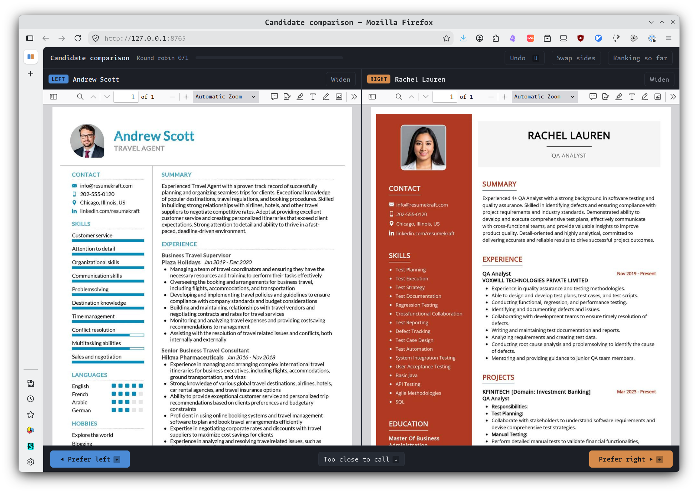

# Candidate comparison

A local-only web app for ranking job applicants. It shows two candidate PDFs
side by side, asks which you prefer, and builds a ranking from your answers.
Nothing is uploaded anywhere.

<a href="screenshot.png">
  
</a>

## The brief

This project was built from a conversation rather than a spec. The requests are
consolidated below into a single prompt that would produce the same thing in
one go.

Note that it deliberately does *not* name an algorithm. Choosing one is the
substantive part of the task, and the constraints below are what force a
sensible choice. (See [Method](#method) for what was chosen and why.)

> **Build a local-only web application for ranking job applicants by pairwise
> comparison.**
>
> **The problem:** I have a directory of candidate CVs as PDFs and need them in
> preference order. Ranking a list directly is hard but choosing between two people
> is easy. The app should repeatedly show me two candidates and ask which I
> prefer, then turn those answers into a ranking.
>
> **Behaviour:**
>
> - Present two candidate PDFs side by side and ask me to pick one. I have a
>   widescreen display, so a genuine 50/50 split is fine.
> - Keep asking until there is enough information to rank everyone. Decide how many comparisons are necessary rather than fixing a number up front, and show me how far through I am.
> - When it's done, present the candidates in ranked order of preference.
>
> **Constraints:** Human judgements are subjective
> and may well be contradictory. I might say A > B, B > C, and then C > A.
> Choose comparison and ranking algorithms that are appropriate for this. The
> system must not assume my preferences are transitive, must not break or
> silently corrupt when they aren't, and should use all of my answers rather
> than discarding evidence. Where my answers genuinely conflict, say so and show
> me where the ranking is weakly supported rather than presenting a false
> precision.
>
> **Data:** Read whatever PDFs are in the `candidates/` directory at startup.
> The candidate list, the comparison schedule and the stopping rule must all
> derive from that count, with no hardcoded number anywhere. It must work
> sensibly for a handful of candidates and still be usable at several dozen,
> where asking me every possible pair would be impractical. Keep the UI
> responsive. I should never wait noticeably after a click.
>
> **Practicalities:**
>
> - Local only. Nothing leaves my machine. Prefer no third-party dependencies.
> - Save progress as I go so I can stop partway and resume later.
> - Let me undo a comparison I misclicked, and give me a way to say two
>   candidates are too close to call.
> - Keyboard shortcuts for the choices because I'll be doing this many times.
> - A small favicon: two boxes side by side.
>
> **Documentation:** Write a `README.md` covering how to run it, where to put
> the PDF files, and how to read the results.

## Requirements

Python 3.8 or newer. No packages to install, no build step.

## Running it

```
python3 server.py
```

It prints the candidates it found, starts a server on `http://127.0.0.1:8765/`,
and opens your browser. Press `Ctrl-C` in the terminal to stop.

If the browser doesn't open by itself, go to <http://127.0.0.1:8765/> manually.

## Where to put the files

Put the PDFs in the `candidates/` directory next to `server.py`:

```
candidate-comparison/
├── server.py
├── index.html
├── state.json          ← created automatically; your progress
└── candidates/
    ├── Lorem_Ipsum_319307_Candidate_Pack.pdf
    ├── Dolor_Sit_317033_Candidate_Pack.pdf
    └── ...
```

Any number of PDFs from 2 upwards. One PDF per candidate.

Only files ending `.pdf` are picked up; anything else in the directory is
ignored. Add or remove PDFs and restart — the candidate list, the comparison
schedule and the stopping rule all adjust to the new count on their own.

### How names are read from filenames

Underscores become spaces. A trailing `_Candidate_Pack` is dropped, and a
trailing run of 4+ digits is treated as a reference number:

| Filename | Shown as |
|---|---|
| `Lorem_Ipsum_319307_Candidate_Pack.pdf` | Lorem Ipsum · 319307 |
| `Jane_Doe.pdf` | Jane Doe |
| `applicant7.pdf` | applicant7 |

It's only for display. Rename files to whatever reads best.

## Using it

The app works through two phases, shown in the progress bar at the top.

1. **Round robin:** every pair compared once, in shuffled order with
   randomised sides. Above 10 candidates a complete round robin gets
   impractical, so it switches to **seeding**: 5 comparisons per candidate,
   enough to put everyone on a comparable footing.
2. **Tie-breaking:** it then asks only the pairs that are still genuinely
   close, re-ranking after each answer, and stops once it's confident about
   every adjacent pair in the ranking. This is the "as many comparisons as
   necessary" part, and how many that turns out to be depends on how
   consistent your answers are.

### Controls

| | |
|---|---|
| `←` | Prefer the left candidate |
| `→` | Prefer the right candidate |
| `↓` | Too close to call |
| `U` | Undo the last comparison |

Or click the buttons. **Too close to call** is recorded as half a win each. Use it rather than forcing a decision you don't believe.

Keyboard shortcuts stop working while your cursor focus is inside a PDF, since
the PDF viewer takes the arrow keys for scrolling. Click outside the PDF, or
just use the buttons.

## Reading the results

- **Strength** is an Elo-style score. A 400-point gap means the model expects
  that candidate to be preferred roughly 10 times out of 11.
- **W–L** is the raw record: how many comparisons that candidate won and lost.
- **Separation** is how often a resample of your own comparisons reproduces
  that ordering. Anything under 90% means those two candidates are effectively
  tied on the evidence so far. Treat them as a band, not an order.
- **Circular preferences** are reported explicitly: if you said A > B, B > C
  and C > A, it names the triple.

## Saving and resuming

Progress is written to `state.json` after every single click. Quit whenever you
like and run `python3 server.py` again to pick up exactly where you left off.

One caveat: comparisons are stored by position in the candidate list, so if you
add or remove a PDF mid-session the saved answers can't be carried over. It
will discard them and print a warning to the terminal saying how many it
dropped. **Finish a ranking before changing `candidates/`.** To start fresh
deliberately, delete `state.json` or use the Start over button.

## Method

Ranking uses **Bradley–Terry** maximum likelihood, fitted with the MM
algorithm. The model is `P(i beats j) = pᵢ / (pᵢ + pⱼ)`.

This is chosen specifically because human judgement is subjective and often
contradictory. Bradley–Terry is a likelihood model, so a
contradictory triad simply pulls those candidates' strengths together and every comparison you make contributes to the result.

A weak prior (half a virtual win and loss against a fixed phantom opponent)
keeps an undefeated or winless candidate's score finite and anchors the scale.

The tie-breaking phase picks whichever pair carries the most information,
measured by Fisher information `q(1−q)`
divided by how often you've already seen that pair, so effort spreads out
instead of hammering one comparison.

Confidence comes from bootstrap resampling: your comparison list is resampled
with replacement several hundred times and refitted, and the app checks how
often each adjacent pair keeps its order.

## Tuning

Constants at the top of `server.py`:

| | Default | |
|---|---|---|
| `PORT` | `8765` | Change if something else is using the port |
| `CONFIDENCE_TARGET` | `0.90` | How sure it must be before stopping. Lower = fewer comparisons |
| `EXTRA_PER_CANDIDATE` | `3` | Cap on tie-breaking comparisons, per candidate |
| `FULL_ROUND_ROBIN_MAX` | `10` | Above this, seed instead of full round robin |
| `SEED_ROUNDS` | `5` | Comparisons per candidate when seeding |
| `PRIOR` | `0.5` | Strength of the Bradley–Terry prior |

Rough scale, with a moderately inconsistent rater: 7 candidates settles in
around 40 comparisons, 20 candidates in around 110, 30 in around 165. If that's
more clicking than you want, lower `CONFIDENCE_TARGET` to `0.8` and accept
softer separation in the middle of the table.

## Troubleshooting

**`Address already in use`**: an old copy is still running. Find it with
`lsof -ti:8765 | xargs kill`, or change `PORT`.

**`Need at least 2 PDFs`**: check the files are directly inside
`candidates/`, not in a subfolder, and that they end in `.pdf`.

**A PDF pane is blank**: the app relies on your browser's built-in PDF
viewer. Chrome, Safari and Firefox all work. If a pane stays blank, open the
PDF directly (candidate names in the results table link to them) to check the
file itself isn't corrupt.

**Large PDFs are slow to appear**: a 12 MB pack takes a moment to render the
first time. The app avoids reloading a PDF that's already on screen, so it
won't lose your scroll position between comparisons.
